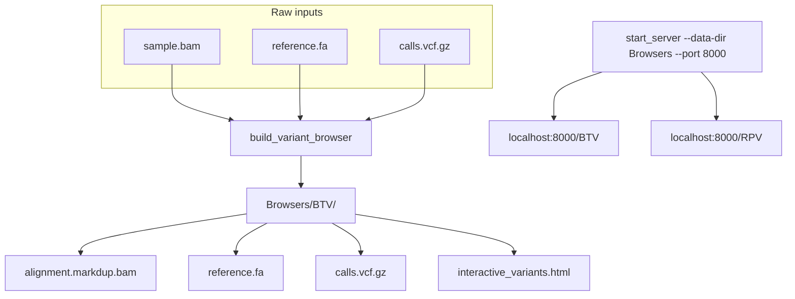

# Allelescope Variant Browser

Allelescope is an interactive, browser-based variant viewer. Each **browser instance** is a self-contained directory of processed alignment, reference, and variant files alongside a  viewer script. A lightweight file server serves one or more instances from a shared **data directory**, and users navigate to each instance in their web browser. The speciality of Allelescope is it allows deeper analysis of reads supporting a variant, offering advanced filtering capabilities that cannot be replicated in browsers like IGV for technical reasons.

Allelescope requires minimally a sorted bam file and a reference. If a VCF file is available variant locations in it can automatically be added to the browser. 

---
## Installation
Allelescope can be obtained from PyPI. You can simply type 
```bash
pip install allelescope
```
and the package will be installed. The package requires Python 3.12 or above.

## Workflow overview



---

## VCF preparation with bcftools

For best results, variant files should be prepared with `bcftools` before being passed to the build script. This ensures the tags that Allelescope relies on are present and correctly formatted.

```bash
# Normalise, left-align indels, and fill in missing tags
bcftools norm -f reference.fa -m -any raw_calls.vcf.gz \
  | bcftools +fill-tags -- -t all \
  | bcftools view -o calls.norm.vcf.gz -O z

bcftools index -t calls.norm.vcf.gz
```

Pass the resulting `calls.norm.vcf.gz` to the build script with `-v`.

---

## Building a Browser For a Dataset 

`build_variant_browser` handles the data preparation step: it takes raw input files, processes and indexes them, and produces the files needed for the viewer — all placed into the instance output directory. The script is invoked with the following syntax:


```
build_variant_browser -b BAM -r FASTA [-v VCF] [-g GENOME_NAME] [-o OUT_DIR] [-t THREADS]
```
The detailed description of flags are shown below.

| Flag | Required | Default | Description |
|---|---|---|---|
| `-b` | Yes | — | Input BAM file |
| `-r` | Yes | — | Reference FASTA file |
| `-v` | No | — | Variant file (VCF or bgzipped VCF.gz, must be sorted) |
| `-g` | No | auto-inferred | Genome name passed to `generate_viewer.py` |
| `-o` | No | `./out_dir` | Output directory (created if it does not exist) |
| `-t` | No | `10` | Number of threads for samtools |
| `-h` | — | — | Print help and exit |


If `-g` is not supplied, the genome name is resolved in this order:

1. First `CHROM` value in the variant file (first non-header data row)
2. First reference sequence name from the BAM `@SQ` header

If neither can be determined, the script exits with an error and asks you to supply `-g` explicitly.


### Dependencies
The following tools are assumed to be installed in the current software environment for the pre-processing work of `build_variant_browser`.

| Tool | Required | Notes |
|---|---|---|
| `samtools` | Always | collate, fixmate, sort, markdup, index, faidx |
| `tabix` | Only with `-v` | indexes the VCF |
| `bgzip` | Only with `-v` | used if the supplied VCF is not already gzipped |

All three are available through [htslib](https://www.htslib.org/download/) or via conda/micromamba. The package was developed using samtools 1.19.2 and htslib 1.19, so it is advised to be cautious using very old versions of samtools that might lack some features. The following can instructs how to build an environment to run Allelescope.

```bash
# Using conda
conda create -n allelescope -c conda-forge -c bioconda samtools=1.19.2 htslib=1.19 
conda activate allelescope

# Using micromamba
micromamba create -n allelescope -c conda-forge -c bioconda samtools=1.19.2 htslib=1.19 
micromamba activate allelescope
```

If you already have a suitable active environment, you can also install directly:

```bash
conda install -c bioconda samtools htslib
```


---

## Examples

**Minimal — BAM and reference only:**
```bash
build_variant_browser \
  -b sample.bam \
  -r reference.fa
```

**With variants:**
```bash
build_variant_browser \
  -b sample.bam \
  -r reference.fa \
  -v calls.norm.vcf.gz
```

**Full options:**
```bash
build_variant_browser.sh \
  -b sample.bam \
  -r reference.fa \
  -v calls.norm.vcf.gz \
  -g D388-WT_OR813926 \
  -o /data/browser_output \
  -t 16
```

---

## What the script does

1. **Validates** that all supplied input files exist and required tools are available.
2. **Resolves the genome name** from the VCF or BAM header if not provided.
3. **Processes the BAM** through a `collate → fixmate → sort → markdup` pipeline and writes `alignment.markdup.bam` to the output directory.
4. **Indexes the BAM** (`.bai`).
5. **Copies the reference FASTA** to the output directory and indexes it with `samtools faidx` (`.fai`).
6. **Copies and indexes the VCF** (if provided). If the file is not bgzipped, it is bgzipped automatically before indexing with `tabix` (`.tbi`).
7. **Invokes `generate_viewer.py`** if it is found in the same directory as the script. If not found, the equivalent command is printed so you can run it manually.

---

## Output directory layout

```
out_dir/
├── alignment.markdup.bam       # Duplicate-marked BAM
├── alignment.markdup.bam.bai   # BAM index
├── reference.fa                # Copy of the reference FASTA
├── reference.fa.fai            # FASTA index
├── calls.norm.vcf.gz           # Copy of the variant file (bgzipped)
├── calls.norm.vcf.gz.tbi       # Tabix index
└── interactive_variants.html   # Generated viewer (entry point)
```

> The variant files are only present if `-v` was supplied.

---

## Starting the file server

The file server takes a **data directory** (the root from which instances are served) and an optional **port**. It does not need to be restarted when new instances are added.

```bash
start_server --data-dir /path/to/Browsers --port 8000
```

| Parameter | Default | Description |
|---|---|---|
| `--data-dir` | current directory | Root directory containing one or more browser instances |
| `--port` | `8000` | Port to listen on |

---

## Accessing browser instances

Once the server is running, navigate to:

```
http://localhost:<port>/<relative-path>
```

where `<relative-path>` is the path from the data directory to the specific instance directory.

## Accessing from a local machine via SSH tunnel

If the file server is running on a remote host, you can forward the server port to your local machine with SSH and then open the browser locally.

On your local machine, run:

```bash
ssh -L <port>:localhost:<port> user@remote.host
```

Then open the URL in Chrome, Edge, or Firefox:

```
http://localhost:<port>/<relative-path>
```

For example, if the remote server uses a port 9000, adjust the tunnel like:

```bash
ssh -L 9000:localhost:8000 user@remote.host
```

and then open:

```
http://localhost:9000/<relative-path>
```

### Multi-instance example

Suppose you have two samples prepared under a shared `Browsers/` directory:

```
Browsers/
├── BTV/
│   ├── alignment.markdup.bam
│   ├── reference.fa
│   └── interactive_variants.html
└── RPV/
    ├── alignment.markdup.bam
    ├── reference.fa
    └── interactive_variants.html
```

Start the server with `Browsers/` as the data directory:

```bash
start_server --data-dir Browsers --port 8000
```

Then open each instance in your browser:

| Sample | URL |
|---|---|
| BTV | http://localhost:8000/BTV |
| RPV | http://localhost:8000/RPV |

To build the two instances in the first place:

```bash
build_variant_browser.sh -b BTV.bam -r BTV_ref.fa -v BTV_calls.vcf.gz -o Browsers/BTV
build_variant_browser.sh -b RPV.bam -r RPV_ref.fa -v RPV_calls.vcf.gz -o Browsers/RPV
```

---

## Notes

- The script exits immediately on any error (`set -euo pipefail`). If a step fails, check the last printed stage heading to identify where it stopped.
- A plain, unsorted VCF will cause `tabix` to fail. Sort your VCF first with `bcftools sort` or `vcf-sort` before passing it to this script.